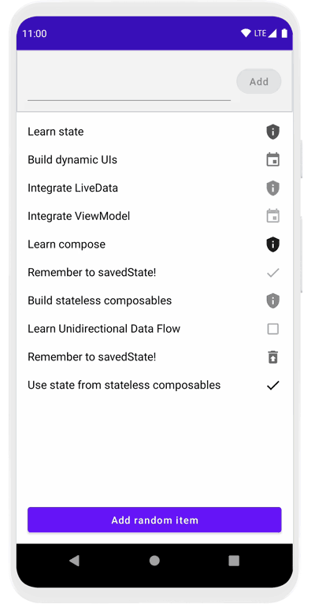

# Using State in Jetpack Compose Codelab

This folder contains the source code for the [Using State in Jetpack Compose codelab](https://developer.android.com/codelabs/jetpack-compose-state).


In this codelab, you will explore patterns for working with state in a declarative world by building a Todo application. We'll see what unidirectional
data flow is, and how to apply it in a Jetpack Compose application to build stateless and stateful composables.

## Screenshots



## License

```
Copyright 2020 The Android Open Source Project

Licensed under the Apache License, Version 2.0 (the "License");
you may not use this file except in compliance with the License.
You may obtain a copy of the License at

    https://www.apache.org/licenses/LICENSE-2.0

Unless required by applicable law or agreed to in writing, software
distributed under the License is distributed on an "AS IS" BASIS,
WITHOUT WARRANTIES OR CONDITIONS OF ANY KIND, either express or implied.
See the License for the specific language governing permissions and
limitations under the License.
```
