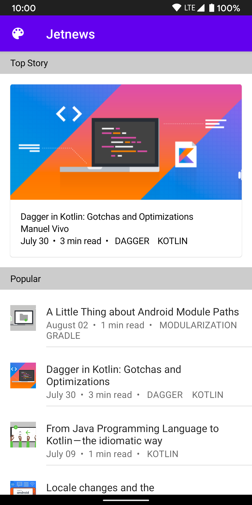
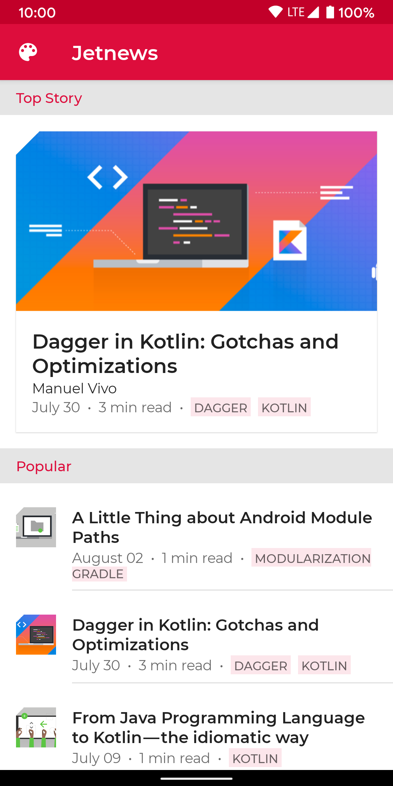

# Jetpack Compose Theming Codelab

This folder contains the source code for the [Jetpack Compose Theming codelab](https://developer.android.com/codelabs/jetpack-compose-theming).

In this codelab you will learn how to use [Jetpack Compose](https://developer.android.com/jetpack/compose)’s theming APIs to style your application. We’ll see how to customize colors, shapes and typography so that they’re used consistently throughout your application, supporting multiple themes such as light & dark theme.

## Screenshots





## License

```
Copyright 2020 The Android Open Source Project

Licensed under the Apache License, Version 2.0 (the "License");
you may not use this file except in compliance with the License.
You may obtain a copy of the License at

    https://www.apache.org/licenses/LICENSE-2.0

Unless required by applicable law or agreed to in writing, software
distributed under the License is distributed on an "AS IS" BASIS,
WITHOUT WARRANTIES OR CONDITIONS OF ANY KIND, either express or implied.
See the License for the specific language governing permissions and
limitations under the License.
```
